# 1. Capstone Project Deliverables

## Project Overview

Wetzin’kwa Community Forest is a 33,000-hectare community forest tenure located on Wet’suwet’en territory near Smithers, British Columbia. The tenure was established in 2007 through a partnership between the Town of Smithers and the Village of Telkwa to support sustainable forest management in the region. Portions of the forest have been previously harvested, and many of these stands are now reaching a developmental stage where thinning or partial harvesting treatments may be appropriate.

## Research Question

How do required different thinning scenarios affect forest stand structure, and how can thinning trails be designed to support efficient and sustainable forest management?

## Study Area & Data Source

**1). Study Area**

The forest is dominated by Lodgepole pine. A surrounding buffer area is excluded from analysis. Three study plots were thinned: Plot 1 and Plot 3 received a 40% light thinning, while Plot 2 underwent variable cluster thinning to create structural diversity.

```{r leaflet_study_area, echo=FALSE, message=FALSE, warning=FALSE}
library(dplyr)
library(leaflet)
library(sf)

# Read shapefiles quietly
plot1 <- suppressMessages(st_read("C:/Users/cjin14.stu/OneDrive - UBC/MGEM/Term2/GEM599(2/E-portfolio/plot1.shp", quiet = TRUE))
plot2 <- suppressMessages(st_read("C:/Users/cjin14.stu/OneDrive - UBC/MGEM/Term2/GEM599(2/E-portfolio/plot2.shp", quiet = TRUE))
plot3 <- suppressMessages(st_read("C:/Users/cjin14.stu/OneDrive - UBC/MGEM/Term2/GEM599(2/E-portfolio/plot3.shp", quiet = TRUE))
buffer <- suppressMessages(st_read("C:/Users/cjin14.stu/OneDrive - UBC/MGEM/Term2/GEM599(2/E-portfolio/buffer.shp", quiet = TRUE))

# Merge plots
plot1 <- plot1[!st_is_empty(plot1), ]
plot2 <- plot2[!st_is_empty(plot2), ]
plot3 <- plot3[!st_is_empty(plot3), ]
plots <- rbind(plot1,plot2,plot3)
buffer <- buffer[!st_is_empty(buffer), ]

# Add color columns
plot1$color <- "green"
plot2$color <- "green"
plot3$color <- "green"
buffer$color <- "orange"

# Optional: keep only geometry + color
plot1 <- plot1 %>% select(color, geometry)
plot2 <- plot2 %>% select(color, geometry)
plot3 <- plot3 %>% select(color, geometry)
buffer <- buffer %>% select(color, geometry)

# Remove Z dimension
plot1_2d <- st_zm(plot1, drop = TRUE, what = "ZM")
plot2_2d <- st_zm(plot2, drop = TRUE, what = "ZM")
plot3_2d <- st_zm(plot3, drop = TRUE, what = "ZM")
buffer_2d <- st_zm(buffer, drop = TRUE, what = "ZM")

# Bounding box
bbox <- st_bbox(plots)
bbox_num <- as.numeric(bbox)

# Create leaflet map
m <- leaflet() %>%
  addProviderTiles("Esri.WorldImagery") %>%
  addPolygons(
    data = plot1_2d,
    fillColor = ~color,
    color = "black",
    weight = 2,
    fillOpacity = 0.5,
    group = "Plot1"
  ) %>%
  addPolygons(
    data = plot2_2d,
    fillColor = ~color,
    color = "black",
    weight = 2,
    fillOpacity = 0.5,
    group = "Plot2"
  ) %>%
  addPolygons(
    data = plot3_2d,
    fillColor = ~color,
    color = "black",
    weight = 2,
    fillOpacity = 0.5,
    group = "Plot3"
  ) %>%
  addPolygons(
    data = buffer_2d,
    fillColor = ~color,
    color = "black",
    weight = 2,
    fillOpacity = 0.5,
    group = "Buffer"
  ) %>%
  addLayersControl(
    overlayGroups = c("Plot1", "Plot2","Plot3","Buffer"),
    options = layersControlOptions(collapsed = FALSE)
  ) %>%
  addScaleBar(position = "bottomleft") %>%
  fitBounds(
    lng1 = bbox_num[1], lat1 = bbox_num[2],
    lng2 = bbox_num[3], lat2 = bbox_num[4]
  )

m

```

**2). Data Source**

-   LiDAR data collected in 2023

-   Field cruise data

-   Aerial imagery shoot in 2023

## Methods

**1). Data extraction from LiDAR, field survey, and aerial imagery**

**LiDAR** - Tree Metrics using LidR Package

```{r lidR package}
#| eval: false
# Read in Lidar data
cat_lidar <- readLAScatalog("file/path")

# Create DEM based on Lidar data
dem <- rasterize_terrain(cat_lidar, 2, tin())

# Normalize Lidar data
norm <- normalize_height(cat_lidar, dem)

# Create CHM based on Normalize Lidar data, 0.5m resolution
chm <- rasterize_canopy(norm, 0.5, p2r(0.2, na.fill = tin())) 

# Dectect treetop based on CHM and window size (2m*2m here)
treetops <- locate_trees(chm,lmf(ws = 2))

# Define arguments used for the segmentation method.
algo_dalponte2016 <- dalponte2016(
  chm,
  treetops,
  th_tree = 2,
  th_seed = 0.45,
  th_cr = 0.55,
  max_cr = 10,
  ID = "treeID"
)

# Read in specific las tile
las <- readLAS("file/path")

# Conduct segmentation to the las tile based on defined segmentation method
seg <- segment_trees(las,algo_dalponte2016)

# Extract tree metrics from the sgmented data
crown <- crown_metrics(seg, func = .stdtreemetrics, geom = "convex")
```

**Field Survey** - Relationship between Diameter at Breast Height (DBH) and Tree Height

```{r}
#| eval: false
# Checking varibales' correlation
pairs(~DBH+Height+logDBH+sqDBH+sqrtDBH, data)

# Fitting the model 
lm(DBH ~ Height, data)

# Testing assumptions
```

**Aerial Imagery** - Manually Select tree top on chosen plots and test the accuracy of treetop detection in lidR.

**2). Spatial Design of Thinning Path**

Least-cost path analysis was conducted using crown size and slope as cost factors. A threshold was then applied to the resulting cost surface to delineate areas with relatively low access cost.

**3). Thinning Treatment**

Thinning for Plot 1 and Plot 3 was simulated directly in the growth and yield model using a 40% thinning intensity. In contrast, Plot 2 was treated with variable density thinning, implemented using a fixed-radius nearest neighbor search method to create clustered spatial patterns before being input into the simulator.

```{r}
#| eval: false
# Define neighborhood radius
radius <- 6

# Find neighboring trees
neighbors <- frNN(coords, eps = radius)

# Count neighbors per tree
crowns$local_n <- lengths(neighbors$id)

# Examine density distribution
quantile(crowns$local_n, probs = c(0.25, 0.5, 0.75))

# Classify trees into density categories
crowns <- crowns %>%
  mutate(
    VDT_class = case_when(
      local_n <= 14 ~ "Gap",
      local_n <= 16 ~ "Low",
      local_n <= 17 ~ "Moderate",
      TRUE         ~ "High"
    )
  )

# Define thinning intensities
thinning_rules <- tibble(
  VDT_class = c("Gap","Low","Moderate","High"),
  remove_pct = c(1.00, 0.20, 0.40, 0.05)
)

# Attach thinning rules to trees
crowns <- left_join(crowns, thinning_rules, by = "VDT_class")

# Set random seed
set.seed(123)

# Select trees to remove
crowns <- crowns %>%
  group_by(VDT_class) %>%
  arrange(TreeHeight) %>%
  mutate(
    remove = row_number() <= floor(n() * unique(remove_pct))
  ) %>%
  ungroup()
```

**4). Yield and Growth Simulator**

The crown data were used to establish the tree list. The generated tree list was formatted as input for the Forest Vegetation Simulator (FVS). This dataset represents the post-thinning stand structure and was used to simulate stand health and merchantable volume dynamics under the defined thinning scenarios.

## Key Results

**1). Data Processing**

The DEM and CHM of the study area

```{r leaflet_chm_dem, echo=FALSE, message=FALSE, warning=FALSE}
library(leaflet)
library(raster)
library(RColorBrewer)

# Load rasters
chm1 <- raster("C:/Users/cjin14.stu/OneDrive - UBC/MGEM/Term2/GEM599(2/E-portfolio/chm_plot1.tif")
chm2 <- raster("C:/Users/cjin14.stu/OneDrive - UBC/MGEM/Term2/GEM599(2/E-portfolio/chm_plot2.tif")
chm3 <- raster("C:/Users/cjin14.stu/OneDrive - UBC/MGEM/Term2/GEM599(2/E-portfolio/chm_plot3.tif")
dem1 <- raster("C:/Users/cjin14.stu/OneDrive - UBC/MGEM/Term2/GEM599(2/E-portfolio/dem_plot1.tif")
dem2 <- raster("C:/Users/cjin14.stu/OneDrive - UBC/MGEM/Term2/GEM599(2/E-portfolio/dem_plot2.tif")
dem3 <- raster("C:/Users/cjin14.stu/OneDrive - UBC/MGEM/Term2/GEM599(2/E-portfolio/dem_plot3.tif")

# Convert 0 or any placeholder NoData values to NA
chm1[chm1 == 0] <- NA
chm2[chm2 == 0] <- NA
chm3[chm3 == 0] <- NA
dem1[dem1 == 0] <- NA
dem2[dem2 == 0] <- NA
dem3[dem3 == 0] <- NA

# Define color palettes (same for all CHM and all DEM)
chm_pal <- colorNumeric("YlGn", c(values(chm1), values(chm2), values(chm3)), na.color = "transparent")
dem_pal <- colorNumeric("Blues", c(values(dem1), values(dem2), values(dem3)), na.color = "transparent")

bbox <- st_bbox(plots)
bbox_num <- as.numeric(bbox)

# Create Leaflet map
m <- leaflet() %>%
  addProviderTiles("Esri.WorldImagery") %>%
  addScaleBar(position = "bottomleft") %>%
  
  # Add all CHM rasters as one group
  addRasterImage(chm1, colors = chm_pal, opacity = 0.6, group = "CHM") %>%
  addRasterImage(chm2, colors = chm_pal, opacity = 0.6, group = "CHM") %>%
  addRasterImage(chm3, colors = chm_pal, opacity = 0.6, group = "CHM") %>%
  addLegend(pal = chm_pal, values = c(values(chm1), values(chm2), values(chm3)),
            title = "CHM", group = "CHM", position = "topright") %>%
  
  # Add all DEM rasters as one group
  addRasterImage(dem1, colors = dem_pal, opacity = 0.6, group = "DEM") %>%
  addRasterImage(dem2, colors = dem_pal, opacity = 0.6, group = "DEM") %>%
  addRasterImage(dem3, colors = dem_pal, opacity = 0.6, group = "DEM") %>%
  addLegend(pal = dem_pal, values = c(values(dem1), values(dem2), values(dem3)),
            title = "DEM", group = "DEM", position = "topright") %>%
  
  # Layer control: one toggle for all CHM, one toggle for all DEM
  addLayersControl(
    baseGroups = c("CHM", "DEM"),
    options = layersControlOptions(collapsed = FALSE)
  )%>%
  fitBounds(
    lng1 = bbox_num[1], lat1 = bbox_num[2],
    lng2 = bbox_num[3], lat2 = bbox_num[4]
  )

m  # Display the map
```

The best performance of the predictive model is shown below, with R\^2 of 0.2099 and RSME of 2.835. The relationship between tree height and diameter at breast height (DBH) is captured by the following equation:

$$
DBH = 8.931 + 0.623 * Height
$$


Treetop detection accuracy was tested using different window sizes (1 m, 2 m, and 3 m). The results showed that a 2 m window size performed best, achieving high values in both precision and recall, and obtaining the highest F1 score among the tested settings.

This indicates that a 2 m window provides a good balance for detecting treetops automatically while minimizing false detection.

 

**2). Thinning Path Design**

This interactive map presents the cost surfaces used to design potential thinning trails. Crown closure cost, slope cost, and the combined total cost are visualized as raster layers. A least-cost surface is also displayed to identify the most efficient routes for thinning access based on terrain difficulty and stand conditions. Users can switch between layers to explore how different factors influence trail planning within the study area.

```{r leaflet_cost, echo=FALSE, message=FALSE, warning=FALSE}
crownCost2 <- raster("C:/Users/cjin14.stu/OneDrive - UBC/MGEM/Term2/GEM599(2/E-portfolio/crownCost2.tif")
slopeCost2 <- raster("C:/Users/cjin14.stu/OneDrive - UBC/MGEM/Term2/GEM599(2/E-portfolio/slopeCost2.tif")
totalCost2 <- raster("C:/Users/cjin14.stu/OneDrive - UBC/MGEM/Term2/GEM599(2/E-portfolio/totalCost2.tif")
leastCost2 <- raster("C:/Users/cjin14.stu/OneDrive - UBC/MGEM/Term2/GEM599(2/E-portfolio/leastCost2.tif")

crownCost2 <- mask(crownCost2, plot2_2d)
slopeCost2 <- mask(slopeCost2, plot2_2d)
totalCost2 <- mask(totalCost2, plot2_2d)
leastCost2[leastCost2 == 0] <- NA

bbox <- st_bbox(plots)
bbox_num <- as.numeric(bbox)

# CrownCost
crown_vals <- c(values(crownCost2))
crown_pal <- colorNumeric(palette = "YlGn", domain = crown_vals, na.color = "transparent")

# SlopeCost
slope_vals <- c(values(slopeCost2))
slope_pal <- colorNumeric(palette = "YlOrBr", domain = slope_vals, na.color = "transparent")

# TotalCost
total_vals <- c(values(totalCost2))
total_pal <- colorNumeric(palette = "Blues", domain = total_vals, na.color = "transparent")

# LeastCost
least_vals <- c(values(leastCost2))
least_pal <- colorNumeric(palette = "inferno", domain = least_vals, na.color = "transparent")

# Create Leaflet map
# Create the map
library(leaflet)
library(htmlwidgets)

# Your raster layers and palettes assumed loaded
m <- leaflet() %>%
  addProviderTiles("Esri.WorldImagery") %>%
  addRasterImage(crownCost2, colors = crown_pal, opacity = 1, group="CrownCost") %>%
  addRasterImage(slopeCost2, colors = slope_pal, opacity = 1, group="SlopeCost") %>%
  addRasterImage(totalCost2, colors = total_pal, opacity = 1, group="TotalCost") %>%
  addRasterImage(leastCost2, colors = least_pal, opacity = 1, group="LeastCost") %>%
  
  addLayersControl(
    baseGroups = c("CrownCost", "SlopeCost", "TotalCost", "LeastCost"),
    options = layersControlOptions(collapsed = FALSE),
    position = "bottomleft"
  ) %>%
  fitBounds(lng1 = bbox_num[1], lat1 = bbox_num[2],
            lng2 = bbox_num[3], lat2 = bbox_num[4]) %>%
  
  # Single HTML container for all legends in topright
  htmlwidgets::onRender("
  function(el, x) {
    var map = this;
    var container = L.DomUtil.create('div', 'custom-legend-container');
    container.style.background = 'white';
    container.style.padding = '5px';
    container.style.borderRadius = '5px';
    container.style.boxShadow = '0 0 5px rgba(0,0,0,0.4)';
    container.style.display = 'grid';
    container.style.gridTemplateColumns = 'auto auto';
    container.style.gridGap = '5px';
    
    function createLegend(title, colorLow, colorHigh) {
      var div = document.createElement('div');
      div.style.fontSize = '12px';
      div.innerHTML = '<b style=\"color:black\">' + title + '</b><br>' +
                      '<i style=\"background:' + colorLow + ';width:20px;height:20px;display:inline-block;margin-right:5px;border:1px solid black\"></i> ' +
                      '<span style=\"color:black\">Low</span><br>' +
                      '<i style=\"background:' + colorHigh + ';width:20px;height:20px;display:inline-block;margin-right:5px;border:1px solid black\"></i> ' +
                      '<span style=\"color:black\">High</span>';
      return div;
    }

    container.appendChild(createLegend('CrownCost','#ffffcc','#006837'));
    container.appendChild(createLegend('SlopeCost','#fff5eb','#7f2704'));
    container.appendChild(createLegend('TotalCost','#deebf7','#08519c'));
    container.appendChild(createLegend('LeastCost','#f0f0f0','#252525'));
    
    L.DomUtil.addClass(container, 'leaflet-control');
    L.DomUtil.addClass(container, 'leaflet-control-custom');
    map.getContainer().appendChild(container);
    L.DomUtil.setPosition(container, {x: map.getSize().x - container.offsetWidth - 10, y: 10});
  }
")
m
```

```{r leaflet_cost2, echo=FALSE, message=FALSE, warning=FALSE}
crownCost1 <- raster("C:/Users/cjin14.stu/OneDrive - UBC/MGEM/Term2/GEM599(2/E-portfolio/crownCost1.tif")
slopeCost1 <- raster("C:/Users/cjin14.stu/OneDrive - UBC/MGEM/Term2/GEM599(2/E-portfolio/slopeCost1.tif")
totalCost1 <- raster("C:/Users/cjin14.stu/OneDrive - UBC/MGEM/Term2/GEM599(2/E-portfolio/totalCost1.tif")
leastCost1 <- raster("C:/Users/cjin14.stu/OneDrive - UBC/MGEM/Term2/GEM599(2/E-portfolio/leastCost1.tif")

crownCost1 <- mask(crownCost1, plot1_2d)
slopeCost1 <- mask(slopeCost1, plot1_2d)
totalCost1 <- mask(totalCost1, plot1_2d)
leastCost1[leastCost1 == 0] <- NA

bbox <- st_bbox(plots)
bbox_num <- as.numeric(bbox)

# CrownCost
crown_vals <- c(values(crownCost1))
crown_pal <- colorNumeric(palette = "YlGn", domain = crown_vals, na.color = "transparent")

# SlopeCost
slope_vals <- c(values(slopeCost1))
slope_pal <- colorNumeric(palette = "YlOrBr", domain = slope_vals, na.color = "transparent")

# TotalCost
total_vals <- c(values(totalCost1))
total_pal <- colorNumeric(palette = "Blues", domain = total_vals, na.color = "transparent")

# LeastCost
least_vals <- c(values(leastCost1))
least_pal <- colorNumeric(palette = "inferno", domain = least_vals, na.color = "transparent")

# Create Leaflet map
# Create the map
library(leaflet)
library(htmlwidgets)

# Your raster layers and palettes assumed loaded
m <- leaflet() %>%
  addProviderTiles("Esri.WorldImagery") %>%
  addRasterImage(crownCost1, colors = crown_pal, opacity = 1, group="CrownCost") %>%
  addRasterImage(slopeCost1, colors = slope_pal, opacity = 1, group="SlopeCost") %>%
  addRasterImage(totalCost1, colors = total_pal, opacity = 1, group="TotalCost") %>%
  addRasterImage(leastCost1, colors = least_pal, opacity = 1, group="LeastCost") %>%
  
  addLayersControl(
    baseGroups = c("CrownCost", "SlopeCost", "TotalCost", "LeastCost"),
    options = layersControlOptions(collapsed = FALSE),
    position = "bottomleft"
  ) %>%
  fitBounds(lng1 = bbox_num[1], lat1 = bbox_num[2],
            lng2 = bbox_num[3], lat2 = bbox_num[4]) %>%
  
  # Single HTML container for all legends in topright
  htmlwidgets::onRender("
  function(el, x) {
    var map = this;
    var container = L.DomUtil.create('div', 'custom-legend-container');
    container.style.background = 'white';
    container.style.padding = '5px';
    container.style.borderRadius = '5px';
    container.style.boxShadow = '0 0 5px rgba(0,0,0,0.4)';
    container.style.display = 'grid';
    container.style.gridTemplateColumns = 'auto auto';
    container.style.gridGap = '5px';
    
    function createLegend(title, colorLow, colorHigh) {
      var div = document.createElement('div');
      div.style.fontSize = '12px';
      div.innerHTML = '<b style=\"color:black\">' + title + '</b><br>' +
                      '<i style=\"background:' + colorLow + ';width:20px;height:20px;display:inline-block;margin-right:5px;border:1px solid black\"></i> ' +
                      '<span style=\"color:black\">Low</span><br>' +
                      '<i style=\"background:' + colorHigh + ';width:20px;height:20px;display:inline-block;margin-right:5px;border:1px solid black\"></i> ' +
                      '<span style=\"color:black\">High</span>';
      return div;
    }

    container.appendChild(createLegend('CrownCost','#ffffcc','#006837'));
    container.appendChild(createLegend('SlopeCost','#fff5eb','#7f2704'));
    container.appendChild(createLegend('TotalCost','#deebf7','#08519c'));
    container.appendChild(createLegend('LeastCost','#f0f0f0','#252525'));
    
    L.DomUtil.addClass(container, 'leaflet-control');
    L.DomUtil.addClass(container, 'leaflet-control-custom');
    map.getContainer().appendChild(container);
    L.DomUtil.setPosition(container, {x: map.getSize().x - container.offsetWidth - 10, y: 10});
  }
")
m

```

```{r leaflet_cost3, echo=FALSE, message=FALSE, warning=FALSE}
crownCost3 <- raster("C:/Users/cjin14.stu/OneDrive - UBC/MGEM/Term2/GEM599(2/E-portfolio/crownCost3.tif")
slopeCost3 <- raster("C:/Users/cjin14.stu/OneDrive - UBC/MGEM/Term2/GEM599(2/E-portfolio/slopeCost3.tif")
totalCost3 <- raster("C:/Users/cjin14.stu/OneDrive - UBC/MGEM/Term2/GEM599(2/E-portfolio/totalCost3.tif")
leastCost3 <- raster("C:/Users/cjin14.stu/OneDrive - UBC/MGEM/Term2/GEM599(2/E-portfolio/leastCost3.tif")

library(raster)

crownCost3 <- mask(crownCost3, plot3_2d)
slopeCost3 <- mask(slopeCost3, plot3_2d)
totalCost3 <- mask(totalCost3, plot3_2d)
leastCost3[leastCost3 == 0] <- NA

bbox <- st_bbox(plots)
bbox_num <- as.numeric(bbox)

# CrownCost
crown_vals <- values(crownCost3)
crown_pal <- colorNumeric("YlGn", domain = NULL, na.color = "transparent")

# SlopeCost
slope_vals <- values(slopeCost3)
slope_pal <- colorNumeric("YlOrBr", domain = NULL, na.color = "transparent")

# TotalCost
total_vals <- values(totalCost3)
total_pal <- colorNumeric("Blues", domain = NULL, na.color = "transparent")

# LeastCost
least_vals <- values(leastCost3)
least_pal <- colorNumeric("inferno", domain = NULL, na.color = "transparent")

# Create Leaflet map
# Create the map
library(leaflet)
library(htmlwidgets)

# Your raster layers and palettes assumed loaded
m <- leaflet() %>%
  addProviderTiles("Esri.WorldImagery") %>%
  addRasterImage(crownCost3, colors = crown_pal, opacity = 1, group="CrownCost", project = TRUE) %>%
  addRasterImage(slopeCost3, colors = slope_pal, opacity = 1, group="SlopeCost", project = TRUE) %>%
  addRasterImage(totalCost3, colors = total_pal, opacity = 1, group="TotalCost", project = TRUE) %>%
  addRasterImage(leastCost3, colors = least_pal, opacity = 1, group="LeastCost", project = TRUE) %>%
  addLayersControl(
    baseGroups = c("CrownCost", "SlopeCost", "TotalCost", "LeastCost"),
    options = layersControlOptions(collapsed = FALSE),
    position = "bottomleft"
  ) %>%
  fitBounds(lng1 = bbox_num[1], lat1 = bbox_num[2],
            lng2 = bbox_num[3], lat2 = bbox_num[4]) %>% 
  
  # Single HTML container for all legends in topright
  htmlwidgets::onRender("
  function(el, x) {
    var map = this;
    var container = L.DomUtil.create('div', 'custom-legend-container');
    container.style.background = 'white';
    container.style.padding = '5px';
    container.style.borderRadius = '5px';
    container.style.boxShadow = '0 0 5px rgba(0,0,0,0.4)';
    container.style.display = 'grid';
    container.style.gridTemplateColumns = 'auto auto';
    container.style.gridGap = '5px';
    
    function createLegend(title, colorLow, colorHigh) {
      var div = document.createElement('div');
      div.style.fontSize = '12px';
      div.innerHTML = '<b style=\"color:black\">' + title + '</b><br>' +
                      '<i style=\"background:' + colorLow + ';width:20px;height:20px;display:inline-block;margin-right:5px;border:1px solid black\"></i> ' +
                      '<span style=\"color:black\">Low</span><br>' +
                      '<i style=\"background:' + colorHigh + ';width:20px;height:20px;display:inline-block;margin-right:5px;border:1px solid black\"></i> ' +
                      '<span style=\"color:black\">High</span>';
      return div;
    }

    container.appendChild(createLegend('CrownCost','#ffffcc','#006837'));
    container.appendChild(createLegend('SlopeCost','#fff5eb','#7f2704'));
    container.appendChild(createLegend('TotalCost','#deebf7','#08519c'));
    container.appendChild(createLegend('LeastCost','#f0f0f0','#252525'));
    
    L.DomUtil.addClass(container, 'leaflet-control');
    L.DomUtil.addClass(container, 'leaflet-control-custom');
    map.getContainer().appendChild(container);
    L.DomUtil.setPosition(container, {x: map.getSize().x - container.offsetWidth - 10, y: 10});
  }
")
m
```

**3). Thinning Treatment**

In plot2, the forest was classified into four density groups: gap, low, medium, and high. Variable density thinning was applied at 100%, 20%, 40%, and 5%, respectively, reducing tree density proportionally and creating a more heterogeneous forest structure.

```{r leaflet_thinningT, echo=FALSE, message=FALSE, warning=FALSE}
VDT <- raster("C:/Users/cjin14.stu/OneDrive - UBC/MGEM/Term2/GEM599(2/E-portfolio/VDT.tif")
residualT <- suppressMessages(st_read("C:/Users/cjin14.stu/OneDrive - UBC/MGEM/Term2/GEM599(2/E-portfolio/residualTrees.shp", quiet = TRUE))

r_pal <- colorNumeric(
  palette = "YlGn",
  domain = values(VDT),
  na.color = "transparent"
)

bbox <- st_bbox(plot2)
bbox_num <- as.numeric(bbox)

m <- leaflet() %>%
  addProviderTiles("Esri.WorldImagery") %>%
  
  # Add raster
  addRasterImage(VDT, colors = r_pal, opacity = 0.8, project = TRUE, group = "VDT") %>%
  addLegend(pal = r_pal, values = values(VDT),
            title = "VDT", position = "topright") %>%
  
  # Add filtered polygons
  addPolygons(data = residualT,
              color = "red", 
              weight = 2, 
              fill = FALSE,
              group = "Residual Trees") %>%
  
  # Add layer control
  addLayersControl(
    overlayGroups = c("Residual Trees", "VDT"),
    options = layersControlOptions(collapsed = FALSE)
  )%>%
  fitBounds(lng1 = bbox_num[1], lat1 = bbox_num[2],
            lng2 = bbox_num[3], lat2 = bbox_num[4])

m
```

**4). Yield and Growth Simulation**

Comparing the 60 years of performance in the three plots, variable density thinning showed a better performance in both stand health and economic regeneration.


# 2. GEM500 Deliverables

This course introduced key concepts of spatial heterogeneity, scale, and landscape patterns, and their importance in ecological processes and environmental management. I learned how to quantify and analyze spatial patterns using landscape ecological tools, and to evaluate the strengths and limitations of different analytical approaches. The course also connected landscape ecology concepts to themes such as ecosystem resilience, carbon and biomass dynamics, and social-ecological systems in natural resource management.

# 3. FCOR510 & FCOR511 Deliverables

Through these courses, I developed an understanding of how knowledge is shaped by social, historical, and ethical contexts and learned to appreciate diverse forms of knowledge and communication methods. I gained skills in knowledge co-production, data ethics, and professional ethical practice, including considerations of privacy, intellectual property, and data sovereignty. The courses also strengthened my ability to reflect on my own worldview, values, and biases, and to effectively communicate specialized topics, manage difficult conversations, and collaborate with diverse teams in environmental management settings.

# 4. GEM510 & GEM511 Deliverables

These courses provided hands-on experience in the design, development, analysis, and visualization of geographic data. I gained skills in GIS database design, spatial data collection and management, and advanced spatial analysis, including terrain modeling, network analysis, geographically weighted regression, and machine learning applications for geospatial data. I also developed abilities to create effective maps and web visualizations, communicate analytical findings to diverse audiences, and document GIS projects with metadata, while understanding the conceptual and practical limitations of GIS tools in environmental management.

**1). SQL statement**

The following example SQL query creates a 15-meter buffer around FSC polygons, calculates the total buffered area per forest type, and sorts the results by area.

```{sql eval=FALSE}
SELECT 
    forest_type AS stand_type,
    COUNT(*) AS polygon_count,
    SUM(ST_Area(ST_Buffer(wkb_geometry, 15))) AS total_buffer_area
FROM ubcv_fsc
WHERE forest_type IS NOT NULL
GROUP BY forest_type
ORDER BY total_buffer_area DESC;
```

**2). Open Map**

This map visualizes the spatial distribution of OpenStreetMap (OSM) nodes within the UBC Campus area. Each polygon represents a Voronoi cell generated from OSM points. Polygons are colored by area, with darker colors representing larger polygons. The map highlights areas of higher and lower node density on campus.

```{r leaflet_openmap, echo=FALSE, message=FALSE, warning=FALSE}
library(sf)
library(leaflet)

voronoi <- suppressMessages(st_read("C:/Users/cjin14.stu/OneDrive - UBC/MGEM/Term2/GEM599(2/E-portfolio/GEM510/osm_campus_voronoi_clip.gpkg", quiet = TRUE))

voronoi$area <- st_area(voronoi)
voronoi$area <- as.numeric(st_area(voronoi))

breaks <- c(12,100,186,295,421,609,848,1219,1879,3451,156235)

pal <- colorBin(
  palette = "YlGnBu",
  domain = voronoi$area_m2,
  bins = breaks
)

leaflet(voronoi) %>%
  addProviderTiles("OpenStreetMap") %>%
  addPolygons(
    fillColor = ~pal(area),
    color = "black",
    weight = 1,
    fillOpacity = 0.5,
    label = ~paste("Area:", round(area,0))
  ) %>%
  addLegend(
    pal = pal,
    values = ~area,
    title = "Polygon Area (m²)",
    position = "bottomright"
  )
```

**3). Least Cost Path**

This map shows the least-cost paths for Grizzly Bears moving across the landscape. Using the accumulated cost-distance raster and the direction raster, the least-cost paths identify the most efficient routes that bears are likely to follow, reflecting how slope and land cover influence their movement patterns.

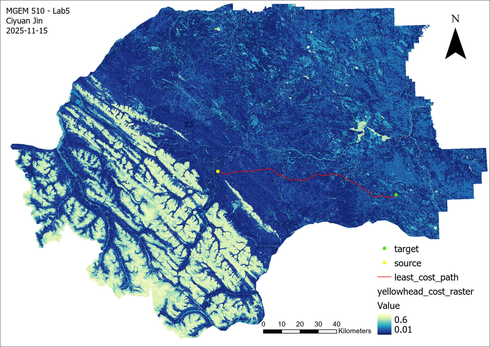

**4). Version Control, Digitizing and Editing**

This map visualizes the results of a geospatial digitization exercise comparing user-created features to official reference data. Using QGIS and ArcGIS Pro, features were digitized and edited, and changes were tracked with Git and Kart. The map highlights areas where digitized features are slightly offset from official datasets, demonstrating the effect of manual digitization on spatial accuracy. All edits were committed, pushed, and version-controlled, and merge conflicts were managed to ensure consistency across working copies, illustrating practical use of distributed version control for geospatial data management.

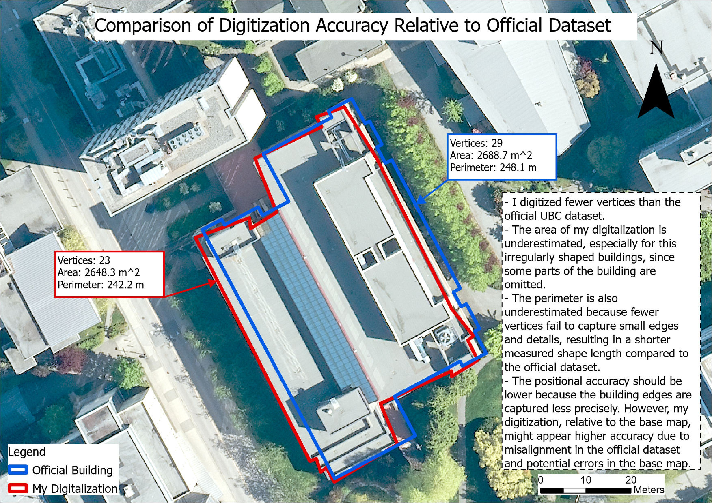

**5). DEMs from a LiDAR Point Cloud**

This map compares Digital Elevation Models (DEMs) generated using Natural Neighbor, Spline, and IDW interpolation methods. The results were evaluated against a binned reference method. Natural Neighbor is recommended for use in the research forest, as it demonstrates low error metrics, strong consistency, and stability across low, medium, and high elevation and slope zones. This visualization highlights differences between interpolation methods and supports informed selection of the most reliable approach for forest terrain analysis.


**6). Network Analysis**

This map panel visualizes the stream network and salmon spawning habitat for one conservation unit on Vancouver Island. Stream routes are symbolized according to their reachability from the ocean, highlighting which segments are accessible to Pacific salmon. Dams are shown as barriers, and stream segments are classified as accessible or inaccessible for spawning based on proximity, slope, and other habitat criteria. A zoomed-in view of Lake Cowichan illustrates local habitat and stream connectivity in detail. The map includes basic cartographic elements such as a title, legend, and scale bar to support interpretation. This visualization demonstrates how GIS can be used to identify and manage critical salmon habitat while accounting for natural and human-made barriers.


# 5. GEM520 & Gem521 Deliverables

These courses provided hands-on and theoretical training in remote sensing for environmental and forest management applications. I developed skills in interpreting spectral properties, processing and analyzing imagery from airborne and satellite sensors, and applying LiDAR, RADAR, and hyperspectral technologies. I also gained experience in digital image processing, object-based image analysis, and using tools such as R, QGIS, ENVI, and Google Earth Engine to analyze, visualize, and communicate spatial data, as well as designing reproducible workflows for data-intensive projects.

**1). Data Cleaning**

Learned three basic rule for a tidy dataset: - Each variable must have its own column - Each observation must have its own row - Each value must have its own cell

```{r eval=FALSE}
# Two ways to convert to tidy data
# 1. To use when columns are not variables but values of a variable.
pivot_longer(data = datasets,
             cols = 'a':'e',
             names_to = "newName",
             values_to = "count")
# 2. To use when an observation is scattered across multiple rows.
pivot_wider(data = datasets,
            names_from = "a",
            values_from = "b")
```

**2). Band Composition**

These maps show the band composition of the satellite imagery, illustrating how different spectral bands are combined to highlight various land features. Each band captures specific wavelengths of light. By creating a composite image, we can visualize and interpret patterns in land cover, vegetation health, water bodies, and other environmental features.

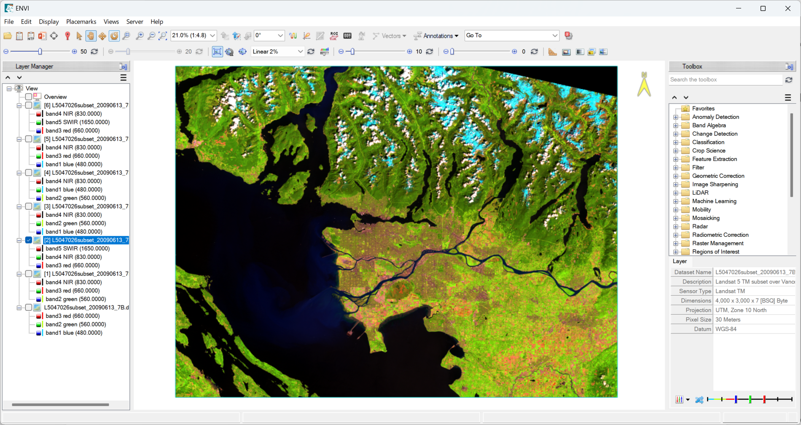 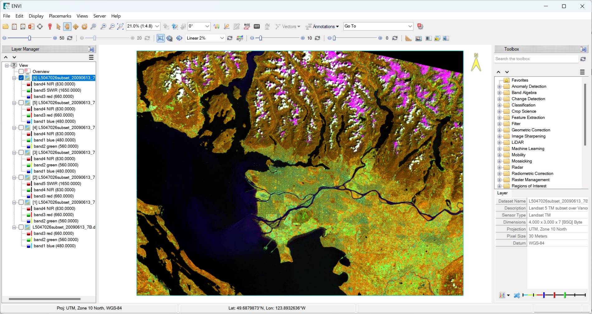 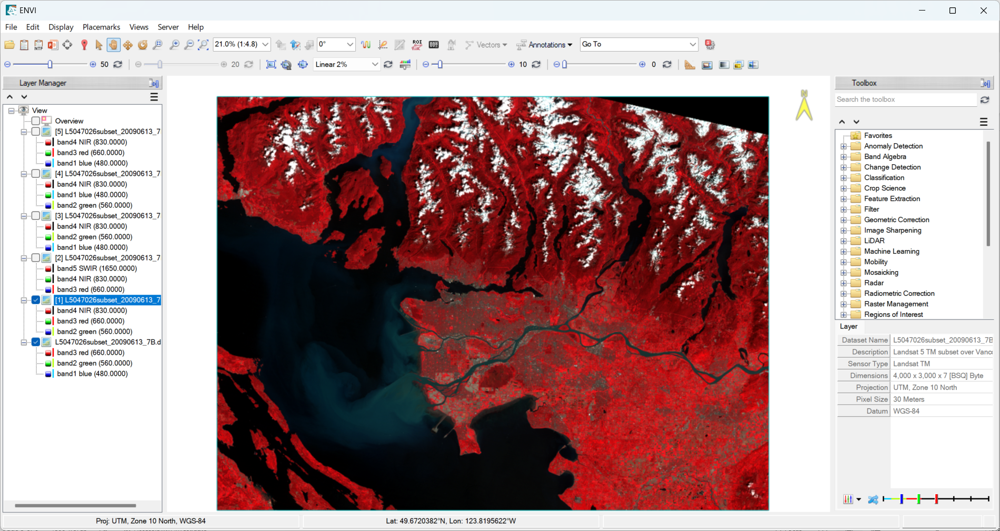

**3). Image Classification**

This lab involved supervised classification of a Landsat scene into seven land cover classes (from 1 to 7): Broadleaf Forest, Coniferous Forest, Exposed Soil and Rocks, High-Density Developed, Low-Density Developed, Non-Forest Vegetation, and Water. The classification process in R produced a thematic map, and an accuracy assessment was conducted using a confusion matrix to calculate user’s, producer’s, and overall accuracy.

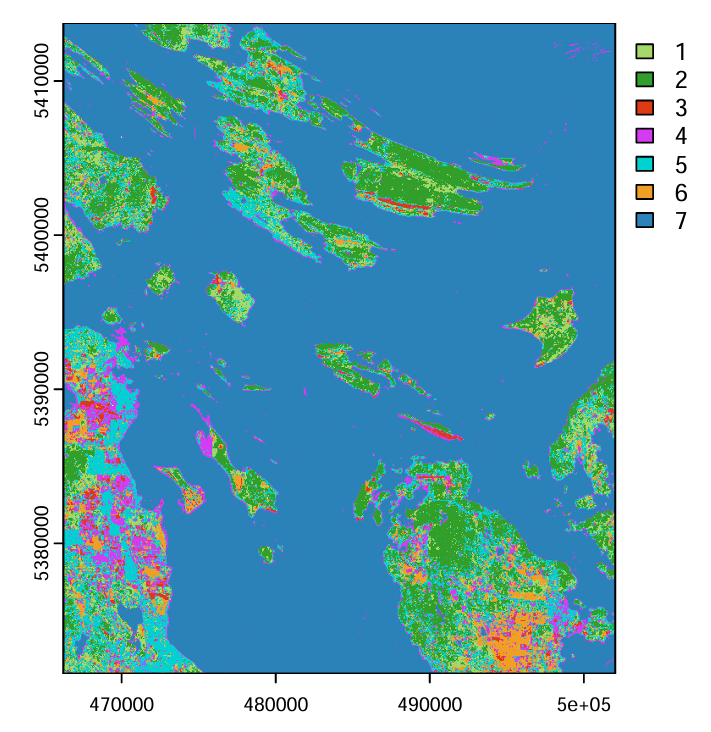 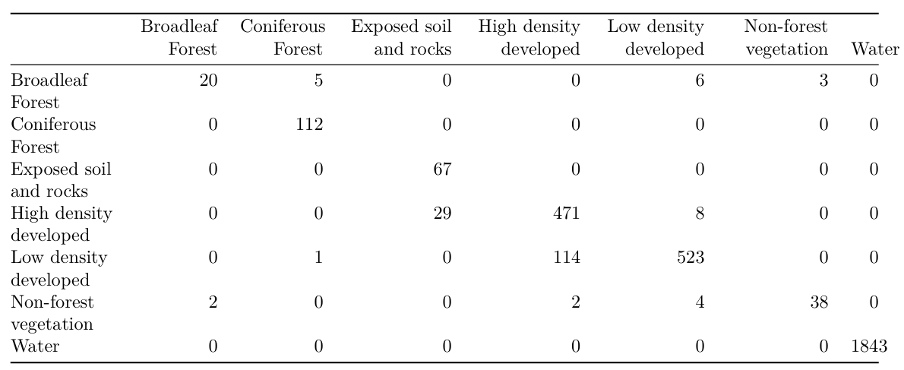

**4). Time-series Analysis**

This set of maps and figures presents a long-term analysis of forest cover using MODIS-derived NDVI products and Virtual Land Cover Engine datasets. The analysis tracks changes in forest area over time, highlighting forest gain and loss dynamics across the study region.

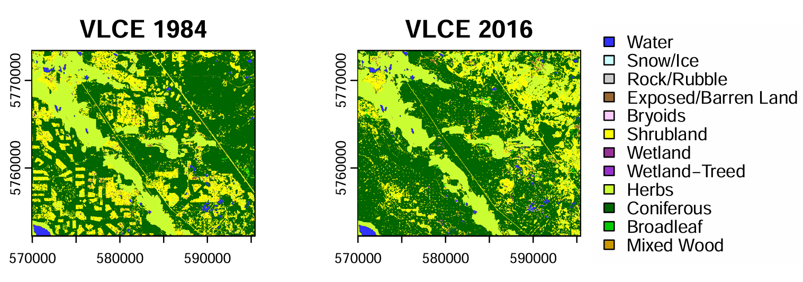 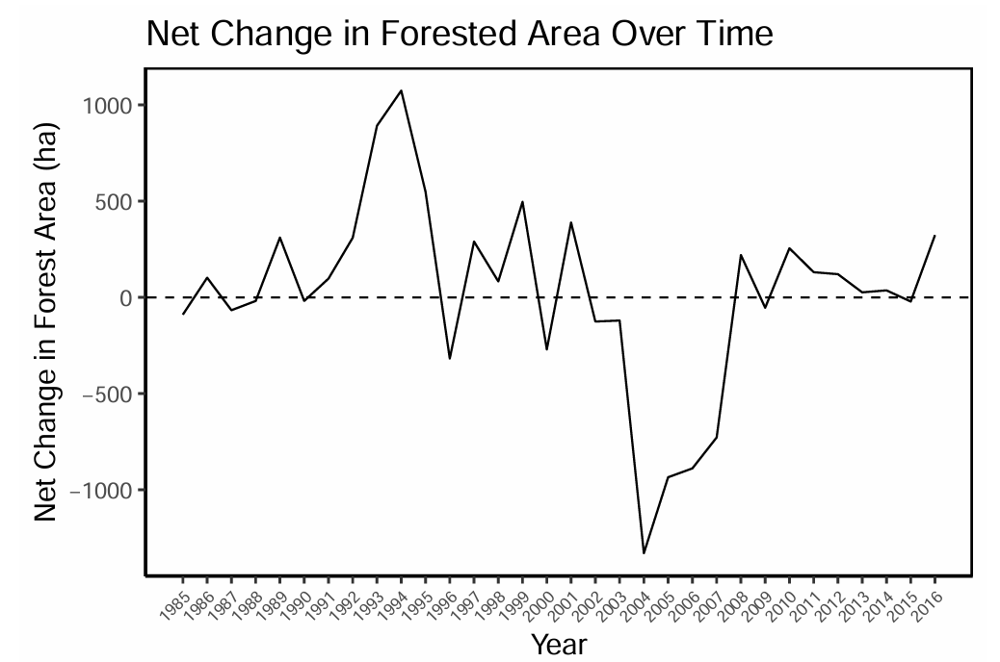 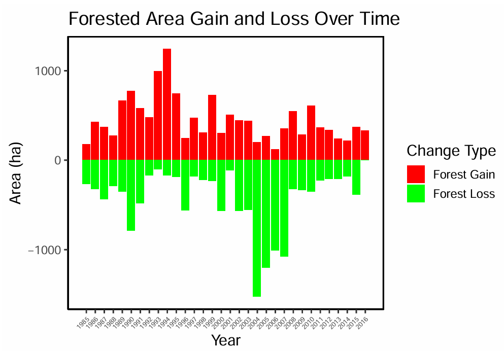

**5).Fire Burn Severity and Post-fire Vegetation Recovery**

These maps visualize post-fire impacts and vegetation recovery using a Landsat 8 OLI time-series of images and NDVI analysis. The first map shows the distribution of post-burn severity, identifying areas most affected by fire. The second map illustrates vegetation recovery from 2008 to 2021, revealing temporal trends in forest regrowth and resilience. This analysis helps me understand fire effects on forest ecosystems and provides critical insights into long-term post-fire recovery patterns for land management and ecological monitoring.

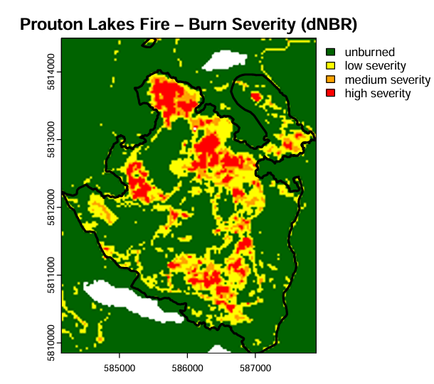 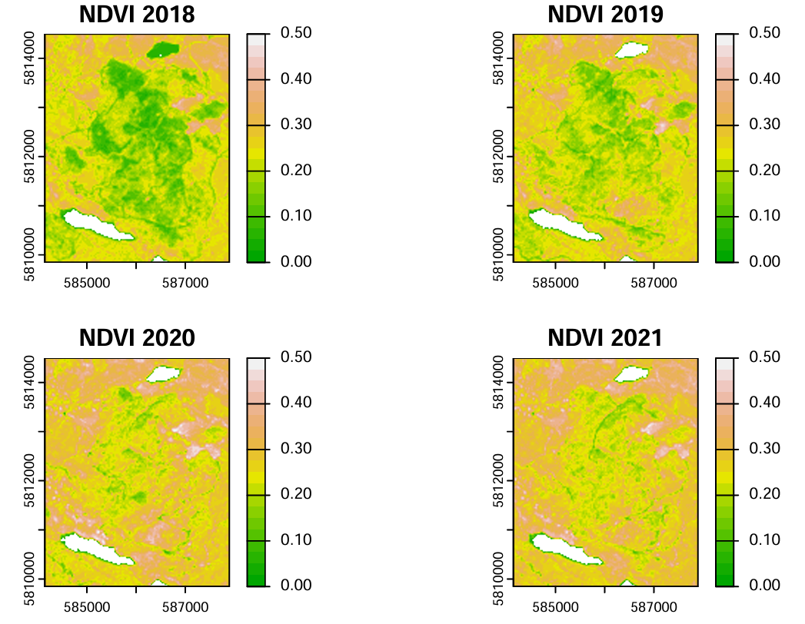

**6). Tree Detection using Lidar**

This figure shows 3D segmentation of individual trees derived from LiDAR point clouds. Each tree is distinctly segmented in three dimensions, highlighting canopy structure, height, and crown boundaries. This visualization demonstrates advanced remote sensing techniques for forest structural analysis, enabling precise tree-level measurements and supporting applications in forest inventory, ecological modeling, and resource management.

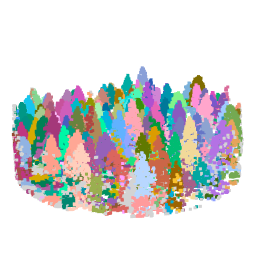

**7). Tree Metrics Relationship Analysis**

Form this anaylsis, I learned forward variable selection, a stepwise approach used to build predictive models by iteratively adding explanatory variables that improve model performance. At each step, variables are evaluated based on criteria such as AIC or R², and only those that significantly enhance the model are included. This method helps identify the most influential predictors, reduces model complexity, and ensures a parsimonious and interpretable model for spatial, ecological, or environmental analysis.

```{r eval=FALSE}
# Start with no variables in our model
model_AGB = lm(Total_AGB ~ 1, data = data_table)

#Now, we add each selected variable to our model one by one, 
#to see which variable is the most  predictor of volume
add1(model_AGB, ~ zmax + zsd + ikurt + zpcum3 + ipcumzq50 + 
       zq60 + zkurt + zpcum9 + zq65 + zpcum8 + zq5, test = 'F')

# zmax was the most significant (lowest Pr(>F)), so we add it to our model
model_AGB = lm(Total_AGB ~ zmax, data = data_table)

#Now, We add each remaining variable to the new model one by one, to see
#if any variable is a significant addition
add1(model_AGB, ~ zmax + zsd + ikurt + zpcum3 + ipcumzq50 + 
       zq60 + zkurt + zpcum9 + zq65 + zpcum8 + zq5, test = 'F')

# zsd was the most significant (lowest Pr(>F)), so we add it to our model
model_AGB = lm(Total_AGB ~ zmax + zsd, data = data_table)

#Again, we test all the remaining variables one by one
add1(model_AGB, ~ zmax + zsd + ikurt + zpcum3 + ipcumzq50 + 
       zq60 + zkurt + zpcum9 + zq65 + zpcum8 + zq5, test = 'F')

# ikurt was the most significant (lowest Pr(>F)), so we add it to our model
model_AGB = lm(Total_AGB ~ zmax + zsd + ikurt, data = data_table)

#Again, we test all the remaining variables one by one
add1(model_AGB, ~ zmax + zsd + ikurt + zpcum3 + ipcumzq50 + 
       zq60 + zkurt + zpcum9 + zq65 + zpcum8 + zq5, test = 'F')

#No additional variables were significant, so we can stop building our model
summary(model_AGB)
```

# 6. GEM530 Deliverables

This course provided hands-on training in Python programming and scripting for geospatial analysis. I learned to process, query, and manipulate geospatial data, moving from graphical interfaces to reproducible scripts, and extending Python with geo-focused modules. Through applied exercises using real-world datasets, I developed skills to analyze environmental management issues, including themes such as carbon and biomass, landscape patterns, and social-ecological perspectives, while building confidence in coding, workflow design, and data-driven problem solving.

**1). Working Enviornment Setting**
```{python eval=FALSE, python.reticulate = FALSE}
# Step 1.  Import ArcPy
import arcpy

# Step 2: Checking Spatial Extension: Get the License
arcpy.CheckOutExtension("Spatial")

# Step 3: Set the workspace to the scratch database and grab the 'spatial' licence

# Step 4: path to the data
scratch = r"path/to/file"

# Step 5: Setting the environment to use
arcpy.env.workspace = scratch

# For avoiding errors to create same files or over writing
arcpy.env.overwriteOutput = True

# Final step: Checking Spatial Extension: return the License
arcpy.CheckInExtension("Spatial")
```

**2). Load and Plot Raster**

::: {.panel-tabset group="language"}
## R
``` (.r eval=FALSE)
library(raster)
r <- raster("data/my_raster.tif")
plot(r, col = terrain.colors(10))
}
```
## Python
``` (.python eval=FALSE)
import rasterio
import matplotlib.pyplot as plt
r = rasterio.open("data/my_raster.tif")
plt.imshow(r.read(1), cmap='terrain')
```
:::

**3). Powerful Libraries and Packages in Python**
```{python eval=FALSE, python.reticulate = FALSE}
import pandas as pd 
import geopandas as gpd
import rasterio
import matplotlib
import math
import numpy
import contextily
import seaborn
```

**4). Useful function in Arcpy**
```{python eval=FALSE, python.reticulate = FALSE}
# Intersection analysis
arcpy.Intersect_analysis(in_features, out_feature_class, {join_attributes}, {cluster_tolerance}, {output_type})
# Merge analysis
arcpy.Merge_management(input_features, output_feature)
# Setting Coordinate Reference System
arcpy.SpatialReference(4326)
# Raster to Polygon
arcpy.conversion.RasterToPolygon(
    in_raster,
    out_polygon_features,
    simplify="NO_SIMPLIFY",
    raster_field="VALUE",
    create_multipart_features="SINGLE_OUTER_PART"
)
# Iterate through rows in a table or feature class and update or delete them.
arcpy.da.UpdateCursor(in_table, field_names, {where_clause}, {spatial_reference}, {explode_to_points}, {sql_clause})
```

# 7. GEM540 Deliverables

This course provided hands-on training in linear regression and spatial statistics using R. I learned to fit, evaluate, and diagnose linear models, apply remedial measures, and perform model selection and evaluation. I also gained skills in analyzing spatial data, including understanding spatial autocorrelation, spatial interpolation, sampling in space, and fitting regression models for spatially correlated data, enabling me to apply statistical and geospatial methods to real-world environmental management problems.