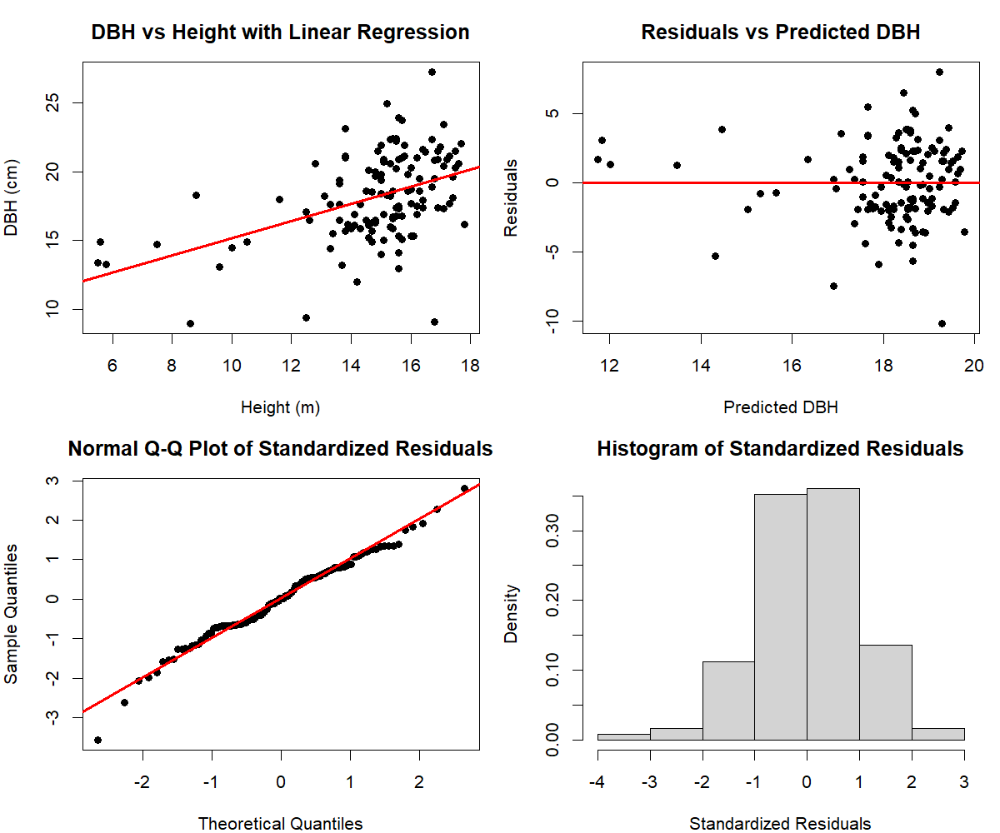
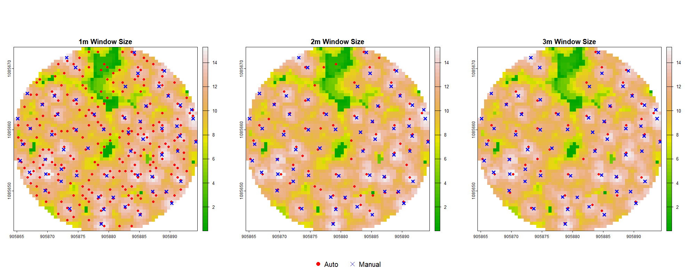
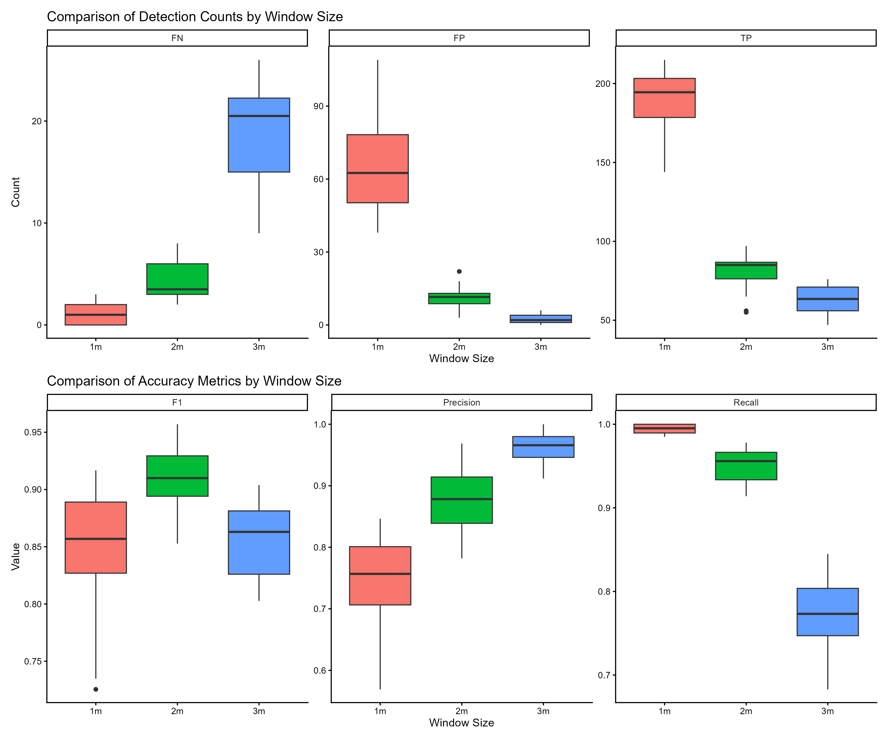
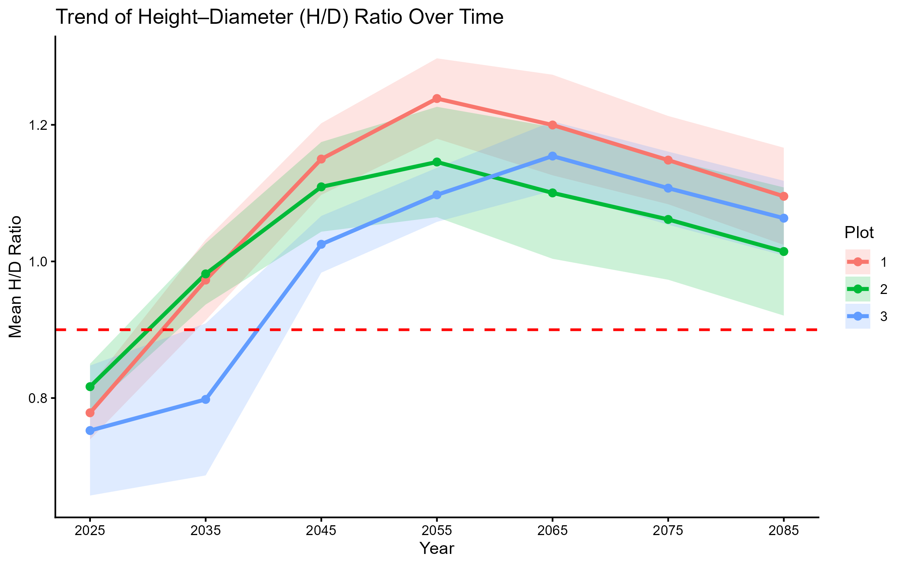
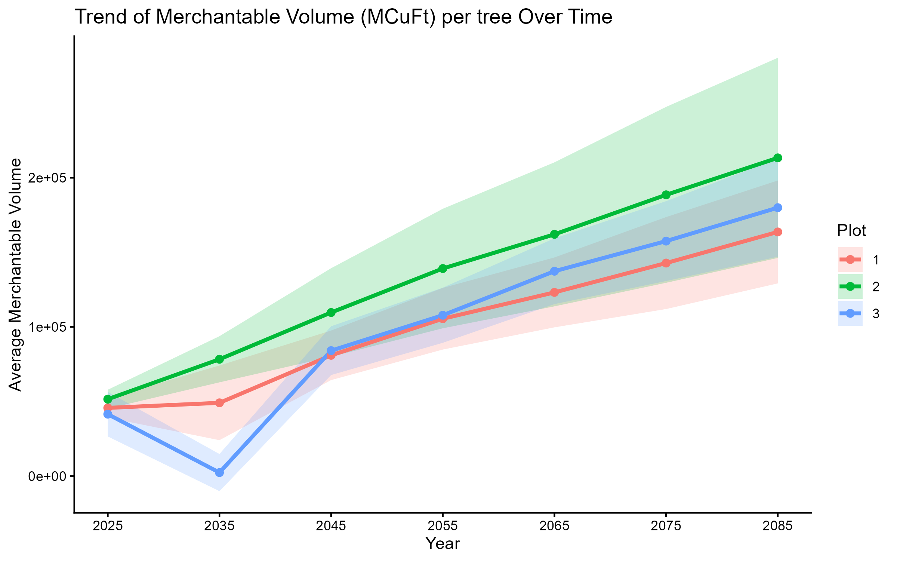

# 1. Capstone Project Deliverables

## Project Overview

Wetzin’kwa Community Forest is a 33,000-hectare community forest tenure located on Wet’suwet’en territory near Smithers, British Columbia. The tenure was established in 2007 through a partnership between the Town of Smithers and the Village of Telkwa to support sustainable forest management in the region. Portions of the forest have been previously harvested, and many of these stands are now reaching a developmental stage where thinning or partial harvesting treatments may be appropriate.

## Research Question

How do required different thinning scenarios affect forest stand structure, and how can thinning trails be designed to support efficient and sustainable forest management?

## Study Area & Data Source

**1). Study Area**

The forest is dominated by Lodgepole pine. A surrounding buffer area is excluded from analysis. Three study plots were thinned: Plot 1 and Plot 3 received a 40% light thinning, while Plot 2 underwent variable cluster thinning to create structural diversity.

```{r leaflet_study_area, echo=FALSE, message=FALSE, warning=FALSE}
library(dplyr)
library(leaflet)
library(sf)

# Read shapefiles quietly
plot1 <- suppressMessages(st_read("C:/Users/cjin14.stu/OneDrive - UBC/MGEM/Term2/GEM599(2/E-portfolio/plot1.shp", quiet = TRUE))
plot2 <- suppressMessages(st_read("C:/Users/cjin14.stu/OneDrive - UBC/MGEM/Term2/GEM599(2/E-portfolio/plot2.shp", quiet = TRUE))
plot3 <- suppressMessages(st_read("C:/Users/cjin14.stu/OneDrive - UBC/MGEM/Term2/GEM599(2/E-portfolio/plot3.shp", quiet = TRUE))
buffer <- suppressMessages(st_read("C:/Users/cjin14.stu/OneDrive - UBC/MGEM/Term2/GEM599(2/E-portfolio/buffer.shp", quiet = TRUE))

# Merge plots
plot1 <- plot1[!st_is_empty(plot1), ]
plot2 <- plot2[!st_is_empty(plot2), ]
plot3 <- plot3[!st_is_empty(plot3), ]
plots <- rbind(plot1,plot2,plot3)
buffer <- buffer[!st_is_empty(buffer), ]

# Add color columns
plot1$color <- "green"
plot2$color <- "green"
plot3$color <- "green"
buffer$color <- "orange"

# Optional: keep only geometry + color
plot1 <- plot1 %>% select(color, geometry)
plot2 <- plot2 %>% select(color, geometry)
plot3 <- plot3 %>% select(color, geometry)
buffer <- buffer %>% select(color, geometry)

# Remove Z dimension
plot1_2d <- st_zm(plot1, drop = TRUE, what = "ZM")
plot2_2d <- st_zm(plot2, drop = TRUE, what = "ZM")
plot3_2d <- st_zm(plot3, drop = TRUE, what = "ZM")
buffer_2d <- st_zm(buffer, drop = TRUE, what = "ZM")

# Bounding box
bbox <- st_bbox(plots)
bbox_num <- as.numeric(bbox)

# Create leaflet map
m <- leaflet() %>%
  addProviderTiles("Esri.WorldImagery") %>%
  addPolygons(
    data = plot1_2d,
    fillColor = ~color,
    color = "black",
    weight = 2,
    fillOpacity = 0.5,
    group = "Plot1"
  ) %>%
  addPolygons(
    data = plot2_2d,
    fillColor = ~color,
    color = "black",
    weight = 2,
    fillOpacity = 0.5,
    group = "Plot2"
  ) %>%
  addPolygons(
    data = plot3_2d,
    fillColor = ~color,
    color = "black",
    weight = 2,
    fillOpacity = 0.5,
    group = "Plot3"
  ) %>%
  addPolygons(
    data = buffer_2d,
    fillColor = ~color,
    color = "black",
    weight = 2,
    fillOpacity = 0.5,
    group = "Buffer"
  ) %>%
  addLayersControl(
    overlayGroups = c("Plot1", "Plot2","Plot3","Buffer"),
    options = layersControlOptions(collapsed = FALSE)
  ) %>%
  addScaleBar(position = "bottomleft") %>%
  fitBounds(
    lng1 = bbox_num[1], lat1 = bbox_num[2],
    lng2 = bbox_num[3], lat2 = bbox_num[4]
  )

m

```

**2). Data Source**

-   LiDAR data collected in 2023

-   Field cruise data

-   Aerial imagery shoot in 2023

## Methods

**1). Data extraction from LiDAR, field survey, and aerial imagery**

**LiDAR** - Tree Metrics using LidR Package

```{r lidR package}
#| eval: false
# Read in Lidar data
cat_lidar <- readLAScatalog("file/path")

# Create DEM based on Lidar data
dem <- rasterize_terrain(cat_lidar, 2, tin())

# Normalize Lidar data
norm <- normalize_height(cat_lidar, dem)

# Create CHM based on Normalize Lidar data, 0.5m resolution
chm <- rasterize_canopy(norm, 0.5, p2r(0.2, na.fill = tin())) 

# Dectect treetop based on CHM and window size (2m*2m here)
treetops <- locate_trees(chm,lmf(ws = 2))

# Define arguments used for the segmentation method.
algo_dalponte2016 <- dalponte2016(
  chm,
  treetops,
  th_tree = 2,
  th_seed = 0.45,
  th_cr = 0.55,
  max_cr = 10,
  ID = "treeID"
)

# Read in specific las tile
las <- readLAS("file/path")

# Conduct segmentation to the las tile based on defined segmentation method
seg <- segment_trees(las,algo_dalponte2016)

# Extract tree metrics from the sgmented data
crown <- crown_metrics(seg, func = .stdtreemetrics, geom = "convex")
```

**Field Survey** - Relationship between Diameter at Breast Height (DBH) and Tree Height

```{r}
#| eval: false
# Checking varibales' correlation
pairs(~DBH+Height+logDBH+sqDBH+sqrtDBH, data)

# Fitting the model 
lm(DBH ~ Height, data)

# Testing assumptions
```

**Aerial Imagery** - Manually Select tree top on chosen plots and test the accuracy of treetop detection in lidR.

**2). Spatial Design of Thinning Path**

Least-cost path analysis was conducted using crown size and slope as cost factors. A threshold was then applied to the resulting cost surface to delineate areas with relatively low access cost.

**3). Thinning Treatment**

Thinning for Plot 1 and Plot 3 was simulated directly in the growth and yield model using a 40% thinning intensity. In contrast, Plot 2 was treated with variable density thinning, implemented using a fixed-radius nearest neighbor search method to create clustered spatial patterns before being input into the simulator.

```{r}
#| eval: false
# Define neighborhood radius
radius <- 6

# Find neighboring trees
neighbors <- frNN(coords, eps = radius)

# Count neighbors per tree
crowns$local_n <- lengths(neighbors$id)

# Examine density distribution
quantile(crowns$local_n, probs = c(0.25, 0.5, 0.75))

# Classify trees into density categories
crowns <- crowns %>%
  mutate(
    VDT_class = case_when(
      local_n <= 14 ~ "Gap",
      local_n <= 16 ~ "Low",
      local_n <= 17 ~ "Moderate",
      TRUE         ~ "High"
    )
  )

# Define thinning intensities
thinning_rules <- tibble(
  VDT_class = c("Gap","Low","Moderate","High"),
  remove_pct = c(1.00, 0.20, 0.40, 0.05)
)

# Attach thinning rules to trees
crowns <- left_join(crowns, thinning_rules, by = "VDT_class")

# Set random seed
set.seed(123)

# Select trees to remove
crowns <- crowns %>%
  group_by(VDT_class) %>%
  arrange(TreeHeight) %>%
  mutate(
    remove = row_number() <= floor(n() * unique(remove_pct))
  ) %>%
  ungroup()
```

**4). Yield and Growth Simulator**

The crown data were used to establish the tree list. The generated tree list was formatted as input for the Forest Vegetation Simulator (FVS). This dataset represents the post-thinning stand structure and was used to simulate stand health and merchantable volume dynamics under the defined thinning scenarios.

## Key Results

**1). Data Processing**

The DEM and CHM of the study area

```{r leaflet_chm_dem, echo=FALSE, message=FALSE, warning=FALSE}
library(leaflet)
library(raster)
library(RColorBrewer)

# Load rasters
chm1 <- raster("C:/Users/cjin14.stu/OneDrive - UBC/MGEM/Term2/GEM599(2/E-portfolio/chm_plot1.tif")
chm2 <- raster("C:/Users/cjin14.stu/OneDrive - UBC/MGEM/Term2/GEM599(2/E-portfolio/chm_plot2.tif")
chm3 <- raster("C:/Users/cjin14.stu/OneDrive - UBC/MGEM/Term2/GEM599(2/E-portfolio/chm_plot3.tif")
dem1 <- raster("C:/Users/cjin14.stu/OneDrive - UBC/MGEM/Term2/GEM599(2/E-portfolio/dem_plot1.tif")
dem2 <- raster("C:/Users/cjin14.stu/OneDrive - UBC/MGEM/Term2/GEM599(2/E-portfolio/dem_plot2.tif")
dem3 <- raster("C:/Users/cjin14.stu/OneDrive - UBC/MGEM/Term2/GEM599(2/E-portfolio/dem_plot3.tif")

# Convert 0 or any placeholder NoData values to NA
chm1[chm1 == 0] <- NA
chm2[chm2 == 0] <- NA
chm3[chm3 == 0] <- NA
dem1[dem1 == 0] <- NA
dem2[dem2 == 0] <- NA
dem3[dem3 == 0] <- NA

# Define color palettes (same for all CHM and all DEM)
chm_pal <- colorNumeric("YlGn", c(values(chm1), values(chm2), values(chm3)), na.color = "transparent")
dem_pal <- colorNumeric("Blues", c(values(dem1), values(dem2), values(dem3)), na.color = "transparent")

bbox <- st_bbox(plots)
bbox_num <- as.numeric(bbox)

# Create Leaflet map
m <- leaflet() %>%
  addProviderTiles("Esri.WorldImagery") %>%
  addScaleBar(position = "bottomleft") %>%
  
  # Add all CHM rasters as one group
  addRasterImage(chm1, colors = chm_pal, opacity = 0.6, group = "CHM") %>%
  addRasterImage(chm2, colors = chm_pal, opacity = 0.6, group = "CHM") %>%
  addRasterImage(chm3, colors = chm_pal, opacity = 0.6, group = "CHM") %>%
  addLegend(pal = chm_pal, values = c(values(chm1), values(chm2), values(chm3)),
            title = "CHM", group = "CHM", position = "topright") %>%
  
  # Add all DEM rasters as one group
  addRasterImage(dem1, colors = dem_pal, opacity = 0.6, group = "DEM") %>%
  addRasterImage(dem2, colors = dem_pal, opacity = 0.6, group = "DEM") %>%
  addRasterImage(dem3, colors = dem_pal, opacity = 0.6, group = "DEM") %>%
  addLegend(pal = dem_pal, values = c(values(dem1), values(dem2), values(dem3)),
            title = "DEM", group = "DEM", position = "topright") %>%
  
  # Layer control: one toggle for all CHM, one toggle for all DEM
  addLayersControl(
    baseGroups = c("CHM", "DEM"),
    options = layersControlOptions(collapsed = FALSE)
  )%>%
  fitBounds(
    lng1 = bbox_num[1], lat1 = bbox_num[2],
    lng2 = bbox_num[3], lat2 = bbox_num[4]
  )

m  # Display the map
```

The best performance of the predictive model is shown below, with R\^2 of 0.2099 and RSME of 2.835. The relationship between tree height and diameter at breast height (DBH) is captured by the following equation:

$$
DBH = 8.931 + 0.623 * Height
$$



Treetop detection accuracy was tested using different window sizes (1 m, 2 m, and 3 m). The results showed that a 2 m window size performed best, achieving high values in both precision and recall, and obtaining the highest F1 score among the tested settings.

This indicates that a 2 m window provides a good balance for detecting treetops automatically while minimizing false detection.

 

**2). Thinning Path Design**

This interactive map presents the cost surfaces used to design potential thinning trails. Crown closure cost, slope cost, and the combined total cost are visualized as raster layers. A least-cost surface is also displayed to identify the most efficient routes for thinning access based on terrain difficulty and stand conditions. Users can switch between layers to explore how different factors influence trail planning within the study area.

```{r leaflet_cost, echo=FALSE, message=FALSE, warning=FALSE}
crownCost2 <- raster("C:/Users/cjin14.stu/OneDrive - UBC/MGEM/Term2/GEM599(2/E-portfolio/crownCost2.tif")
slopeCost2 <- raster("C:/Users/cjin14.stu/OneDrive - UBC/MGEM/Term2/GEM599(2/E-portfolio/slopeCost2.tif")
totalCost2 <- raster("C:/Users/cjin14.stu/OneDrive - UBC/MGEM/Term2/GEM599(2/E-portfolio/totalCost2.tif")
leastCost2 <- raster("C:/Users/cjin14.stu/OneDrive - UBC/MGEM/Term2/GEM599(2/E-portfolio/leastCost2.tif")

crownCost2 <- mask(crownCost2, plot2_2d)
slopeCost2 <- mask(slopeCost2, plot2_2d)
totalCost2 <- mask(totalCost2, plot2_2d)
leastCost2[leastCost2 == 0] <- NA

bbox <- st_bbox(plots)
bbox_num <- as.numeric(bbox)

# CrownCost
crown_vals <- c(values(crownCost2))
crown_pal <- colorNumeric(palette = "YlGn", domain = crown_vals, na.color = "transparent")

# SlopeCost
slope_vals <- c(values(slopeCost2))
slope_pal <- colorNumeric(palette = "YlOrBr", domain = slope_vals, na.color = "transparent")

# TotalCost
total_vals <- c(values(totalCost2))
total_pal <- colorNumeric(palette = "Blues", domain = total_vals, na.color = "transparent")

# LeastCost
least_vals <- c(values(leastCost2))
least_pal <- colorNumeric(palette = "inferno", domain = least_vals, na.color = "transparent")

# Create Leaflet map
# Create the map
library(leaflet)
library(htmlwidgets)

# Your raster layers and palettes assumed loaded
m <- leaflet() %>%
  addProviderTiles("Esri.WorldImagery") %>%
  addRasterImage(crownCost2, colors = crown_pal, opacity = 1, group="CrownCost") %>%
  addRasterImage(slopeCost2, colors = slope_pal, opacity = 1, group="SlopeCost") %>%
  addRasterImage(totalCost2, colors = total_pal, opacity = 1, group="TotalCost") %>%
  addRasterImage(leastCost2, colors = least_pal, opacity = 1, group="LeastCost") %>%
  
  addLayersControl(
    baseGroups = c("CrownCost", "SlopeCost", "TotalCost", "LeastCost"),
    options = layersControlOptions(collapsed = FALSE),
    position = "bottomleft"
  ) %>%
  fitBounds(lng1 = bbox_num[1], lat1 = bbox_num[2],
            lng2 = bbox_num[3], lat2 = bbox_num[4]) %>%
  
  # Single HTML container for all legends in topright
  htmlwidgets::onRender("
  function(el, x) {
    var map = this;
    var container = L.DomUtil.create('div', 'custom-legend-container');
    container.style.background = 'white';
    container.style.padding = '5px';
    container.style.borderRadius = '5px';
    container.style.boxShadow = '0 0 5px rgba(0,0,0,0.4)';
    container.style.display = 'grid';
    container.style.gridTemplateColumns = 'auto auto';
    container.style.gridGap = '5px';
    
    function createLegend(title, colorLow, colorHigh) {
      var div = document.createElement('div');
      div.style.fontSize = '12px';
      div.innerHTML = '<b style=\"color:black\">' + title + '</b><br>' +
                      '<i style=\"background:' + colorLow + ';width:20px;height:20px;display:inline-block;margin-right:5px;border:1px solid black\"></i> ' +
                      '<span style=\"color:black\">Low</span><br>' +
                      '<i style=\"background:' + colorHigh + ';width:20px;height:20px;display:inline-block;margin-right:5px;border:1px solid black\"></i> ' +
                      '<span style=\"color:black\">High</span>';
      return div;
    }

    container.appendChild(createLegend('CrownCost','#ffffcc','#006837'));
    container.appendChild(createLegend('SlopeCost','#fff5eb','#7f2704'));
    container.appendChild(createLegend('TotalCost','#deebf7','#08519c'));
    container.appendChild(createLegend('LeastCost','#f0f0f0','#252525'));
    
    L.DomUtil.addClass(container, 'leaflet-control');
    L.DomUtil.addClass(container, 'leaflet-control-custom');
    map.getContainer().appendChild(container);
    L.DomUtil.setPosition(container, {x: map.getSize().x - container.offsetWidth - 10, y: 10});
  }
")
m
```

```{r leaflet_cost2, echo=FALSE, message=FALSE, warning=FALSE}
crownCost1 <- raster("C:/Users/cjin14.stu/OneDrive - UBC/MGEM/Term2/GEM599(2/E-portfolio/crownCost1.tif")
slopeCost1 <- raster("C:/Users/cjin14.stu/OneDrive - UBC/MGEM/Term2/GEM599(2/E-portfolio/slopeCost1.tif")
totalCost1 <- raster("C:/Users/cjin14.stu/OneDrive - UBC/MGEM/Term2/GEM599(2/E-portfolio/totalCost1.tif")
leastCost1 <- raster("C:/Users/cjin14.stu/OneDrive - UBC/MGEM/Term2/GEM599(2/E-portfolio/leastCost1.tif")

crownCost1 <- mask(crownCost1, plot1_2d)
slopeCost1 <- mask(slopeCost1, plot1_2d)
totalCost1 <- mask(totalCost1, plot1_2d)
leastCost1[leastCost1 == 0] <- NA

bbox <- st_bbox(plots)
bbox_num <- as.numeric(bbox)

# CrownCost
crown_vals <- c(values(crownCost1))
crown_pal <- colorNumeric(palette = "YlGn", domain = crown_vals, na.color = "transparent")

# SlopeCost
slope_vals <- c(values(slopeCost1))
slope_pal <- colorNumeric(palette = "YlOrBr", domain = slope_vals, na.color = "transparent")

# TotalCost
total_vals <- c(values(totalCost1))
total_pal <- colorNumeric(palette = "Blues", domain = total_vals, na.color = "transparent")

# LeastCost
least_vals <- c(values(leastCost1))
least_pal <- colorNumeric(palette = "inferno", domain = least_vals, na.color = "transparent")

# Create Leaflet map
# Create the map
library(leaflet)
library(htmlwidgets)

# Your raster layers and palettes assumed loaded
m <- leaflet() %>%
  addProviderTiles("Esri.WorldImagery") %>%
  addRasterImage(crownCost1, colors = crown_pal, opacity = 1, group="CrownCost") %>%
  addRasterImage(slopeCost1, colors = slope_pal, opacity = 1, group="SlopeCost") %>%
  addRasterImage(totalCost1, colors = total_pal, opacity = 1, group="TotalCost") %>%
  addRasterImage(leastCost1, colors = least_pal, opacity = 1, group="LeastCost") %>%
  
  addLayersControl(
    baseGroups = c("CrownCost", "SlopeCost", "TotalCost", "LeastCost"),
    options = layersControlOptions(collapsed = FALSE),
    position = "bottomleft"
  ) %>%
  fitBounds(lng1 = bbox_num[1], lat1 = bbox_num[2],
            lng2 = bbox_num[3], lat2 = bbox_num[4]) %>%
  
  # Single HTML container for all legends in topright
  htmlwidgets::onRender("
  function(el, x) {
    var map = this;
    var container = L.DomUtil.create('div', 'custom-legend-container');
    container.style.background = 'white';
    container.style.padding = '5px';
    container.style.borderRadius = '5px';
    container.style.boxShadow = '0 0 5px rgba(0,0,0,0.4)';
    container.style.display = 'grid';
    container.style.gridTemplateColumns = 'auto auto';
    container.style.gridGap = '5px';
    
    function createLegend(title, colorLow, colorHigh) {
      var div = document.createElement('div');
      div.style.fontSize = '12px';
      div.innerHTML = '<b style=\"color:black\">' + title + '</b><br>' +
                      '<i style=\"background:' + colorLow + ';width:20px;height:20px;display:inline-block;margin-right:5px;border:1px solid black\"></i> ' +
                      '<span style=\"color:black\">Low</span><br>' +
                      '<i style=\"background:' + colorHigh + ';width:20px;height:20px;display:inline-block;margin-right:5px;border:1px solid black\"></i> ' +
                      '<span style=\"color:black\">High</span>';
      return div;
    }

    container.appendChild(createLegend('CrownCost','#ffffcc','#006837'));
    container.appendChild(createLegend('SlopeCost','#fff5eb','#7f2704'));
    container.appendChild(createLegend('TotalCost','#deebf7','#08519c'));
    container.appendChild(createLegend('LeastCost','#f0f0f0','#252525'));
    
    L.DomUtil.addClass(container, 'leaflet-control');
    L.DomUtil.addClass(container, 'leaflet-control-custom');
    map.getContainer().appendChild(container);
    L.DomUtil.setPosition(container, {x: map.getSize().x - container.offsetWidth - 10, y: 10});
  }
")
m

```

```{r leaflet_cost3, echo=FALSE, message=FALSE, warning=FALSE}
crownCost3 <- raster("C:/Users/cjin14.stu/OneDrive - UBC/MGEM/Term2/GEM599(2/E-portfolio/crownCost3.tif")
slopeCost3 <- raster("C:/Users/cjin14.stu/OneDrive - UBC/MGEM/Term2/GEM599(2/E-portfolio/slopeCost3.tif")
totalCost3 <- raster("C:/Users/cjin14.stu/OneDrive - UBC/MGEM/Term2/GEM599(2/E-portfolio/totalCost3.tif")
leastCost3 <- raster("C:/Users/cjin14.stu/OneDrive - UBC/MGEM/Term2/GEM599(2/E-portfolio/leastCost3.tif")

library(raster)

crownCost3 <- mask(crownCost3, plot3_2d)
slopeCost3 <- mask(slopeCost3, plot3_2d)
totalCost3 <- mask(totalCost3, plot3_2d)
leastCost3[leastCost3 == 0] <- NA

bbox <- st_bbox(plots)
bbox_num <- as.numeric(bbox)

# CrownCost
crown_vals <- values(crownCost3)
crown_pal <- colorNumeric("YlGn", domain = NULL, na.color = "transparent")

# SlopeCost
slope_vals <- values(slopeCost3)
slope_pal <- colorNumeric("YlOrBr", domain = NULL, na.color = "transparent")

# TotalCost
total_vals <- values(totalCost3)
total_pal <- colorNumeric("Blues", domain = NULL, na.color = "transparent")

# LeastCost
least_vals <- values(leastCost3)
least_pal <- colorNumeric("inferno", domain = NULL, na.color = "transparent")

# Create Leaflet map
# Create the map
library(leaflet)
library(htmlwidgets)

# Your raster layers and palettes assumed loaded
m <- leaflet() %>%
  addProviderTiles("Esri.WorldImagery") %>%
  addRasterImage(crownCost3, colors = crown_pal, opacity = 1, group="CrownCost", project = TRUE) %>%
  addRasterImage(slopeCost3, colors = slope_pal, opacity = 1, group="SlopeCost", project = TRUE) %>%
  addRasterImage(totalCost3, colors = total_pal, opacity = 1, group="TotalCost", project = TRUE) %>%
  addRasterImage(leastCost3, colors = least_pal, opacity = 1, group="LeastCost", project = TRUE) %>%
  addLayersControl(
    baseGroups = c("CrownCost", "SlopeCost", "TotalCost", "LeastCost"),
    options = layersControlOptions(collapsed = FALSE),
    position = "bottomleft"
  ) %>%
  fitBounds(lng1 = bbox_num[1], lat1 = bbox_num[2],
            lng2 = bbox_num[3], lat2 = bbox_num[4]) %>% 
  
  # Single HTML container for all legends in topright
  htmlwidgets::onRender("
  function(el, x) {
    var map = this;
    var container = L.DomUtil.create('div', 'custom-legend-container');
    container.style.background = 'white';
    container.style.padding = '5px';
    container.style.borderRadius = '5px';
    container.style.boxShadow = '0 0 5px rgba(0,0,0,0.4)';
    container.style.display = 'grid';
    container.style.gridTemplateColumns = 'auto auto';
    container.style.gridGap = '5px';
    
    function createLegend(title, colorLow, colorHigh) {
      var div = document.createElement('div');
      div.style.fontSize = '12px';
      div.innerHTML = '<b style=\"color:black\">' + title + '</b><br>' +
                      '<i style=\"background:' + colorLow + ';width:20px;height:20px;display:inline-block;margin-right:5px;border:1px solid black\"></i> ' +
                      '<span style=\"color:black\">Low</span><br>' +
                      '<i style=\"background:' + colorHigh + ';width:20px;height:20px;display:inline-block;margin-right:5px;border:1px solid black\"></i> ' +
                      '<span style=\"color:black\">High</span>';
      return div;
    }

    container.appendChild(createLegend('CrownCost','#ffffcc','#006837'));
    container.appendChild(createLegend('SlopeCost','#fff5eb','#7f2704'));
    container.appendChild(createLegend('TotalCost','#deebf7','#08519c'));
    container.appendChild(createLegend('LeastCost','#f0f0f0','#252525'));
    
    L.DomUtil.addClass(container, 'leaflet-control');
    L.DomUtil.addClass(container, 'leaflet-control-custom');
    map.getContainer().appendChild(container);
    L.DomUtil.setPosition(container, {x: map.getSize().x - container.offsetWidth - 10, y: 10});
  }
")
m
```

**3). Thinning Treatment**

In plot2, the forest was classified into four density groups: gap, low, medium, and high. Variable density thinning was applied at 100%, 20%, 40%, and 5%, respectively, reducing tree density proportionally and creating a more heterogeneous forest structure.

```{r leaflet_thinningT, echo=FALSE, message=FALSE, warning=FALSE}
VDT <- raster("C:/Users/cjin14.stu/OneDrive - UBC/MGEM/Term2/GEM599(2/E-portfolio/VDT.tif")
residualT <- suppressMessages(st_read("C:/Users/cjin14.stu/OneDrive - UBC/MGEM/Term2/GEM599(2/E-portfolio/residualTrees.shp", quiet = TRUE))

r_pal <- colorNumeric(
  palette = "YlGn",
  domain = values(VDT),
  na.color = "transparent"
)

bbox <- st_bbox(plot2)
bbox_num <- as.numeric(bbox)

m <- leaflet() %>%
  addProviderTiles("Esri.WorldImagery") %>%
  
  # Add raster
  addRasterImage(VDT, colors = r_pal, opacity = 0.8, project = TRUE, group = "VDT") %>%
  addLegend(pal = r_pal, values = values(VDT),
            title = "VDT", position = "topright") %>%
  
  # Add filtered polygons
  addPolygons(data = residualT,
              color = "red", 
              weight = 2, 
              fill = FALSE,
              group = "Residual Trees") %>%
  
  # Add layer control
  addLayersControl(
    overlayGroups = c("Residual Trees", "VDT"),
    options = layersControlOptions(collapsed = FALSE)
  )%>%
  fitBounds(lng1 = bbox_num[1], lat1 = bbox_num[2],
            lng2 = bbox_num[3], lat2 = bbox_num[4])

m
```

**4). Yield and Growth Simulation**

Comparing the 60 years of performance in the three plots, variable density thinning showed a better performance in both stand health and economic regeneration.





# 2.  GEM500 Deliverables

This course introduced key concepts of spatial heterogeneity, scale, and landscape patterns, and their importance in ecological processes and environmental management. I learned how to quantify and analyze spatial patterns using landscape ecological tools, and to evaluate the strengths and limitations of different analytical approaches. The course also connected landscape ecology concepts to themes such as ecosystem resilience, carbon and biomass dynamics, and social-ecological systems in natural resource management.

# 3. FCOR511 & FCOR510 Deliverables

Through these courses, I developed an understanding of how knowledge is shaped by social, historical, and ethical contexts and learned to appreciate diverse forms of knowledge and communication methods. I gained skills in knowledge co-production, data ethics, and professional ethical practice, including considerations of privacy, intellectual property, and data sovereignty. The courses also strengthened my ability to reflect on my own worldview, values, and biases, and to effectively communicate specialized topics, manage difficult conversations, and collaborate with diverse teams in environmental management settings.

# 4. GEM510 & GEM511 Deliverables

These courses provided hands-on experience in the design, development, analysis, and visualization of geographic data. I gained skills in GIS database design, spatial data collection and management, and advanced spatial analysis, including terrain modeling, network analysis, geographically weighted regression, and machine learning applications for geospatial data. I also developed abilities to create effective maps and web visualizations, communicate analytical findings to diverse audiences, and document GIS projects with metadata, while understanding the conceptual and practical limitations of GIS tools in environmental management.

**SQL statement**

```         
# Format: SELECT ... INTO ... FROM ...;
SELECT ST_Buffer(wkb_geometry, 15) INTO ubcv_fsc_buffer FROM ubcv_fsc;
# For example, this code uses the buffer function ST_Buffer with a geometry field wkb_geometry and a buffer distance 15 , on the FSC polygon FROM ubcv_fsc, and then write the resulting buffer to a new table INTO ubcv_fsc_buffer

# Format: SELECT*INTO ... FROM ... WHERE ...;
SELECT * INTO ubcv_fsc_trees FROM ubcv_campus_trees, ubcv_fsc_buffer WHERE ST_Intersects(wkb_geometry, st_buffer);
# For example, the ST_Intersects takes two geometry fields wkb_geometry (ubcv_campus_trees) and st_buffer (ubcv_fsc_buffer), computes the intersection, and returns the features from the first geometry argument (ubcv_campus_trees) to a new table INTO ubcv_fsc_trees
```

# 5. GEM520 & Gem521 Deliverables

These courses provided hands-on and theoretical training in remote sensing for environmental and forest management applications. I developed skills in interpreting spectral properties, processing and analyzing imagery from airborne and satellite sensors, and applying LiDAR, RADAR, and hyperspectral technologies. I also gained experience in digital image processing, object-based image analysis, and using tools such as R, QGIS, ENVI, and Google Earth Engine to analyze, visualize, and communicate spatial data, as well as designing reproducible workflows for data-intensive projects.

# 6. GEM530 Deliverables

This course provided hands-on training in Python programming and scripting for geospatial analysis. I learned to process, query, and manipulate geospatial data, moving from graphical interfaces to reproducible scripts, and extending Python with geo-focused modules. Through applied exercises using real-world datasets, I developed skills to analyze environmental management issues, including themes such as carbon and biomass, landscape patterns, and social-ecological perspectives, while building confidence in coding, workflow design, and data-driven problem solving.

# 7. GEM540 Deliverables

This course provided hands-on training in linear regression and spatial statistics using R. I learned to fit, evaluate, and diagnose linear models, apply remedial measures, and perform model selection and evaluation. I also gained skills in analyzing spatial data, including understanding spatial autocorrelation, spatial interpolation, sampling in space, and fitting regression models for spatially correlated data, enabling me to apply statistical and geospatial methods to real-world environmental management problems.
